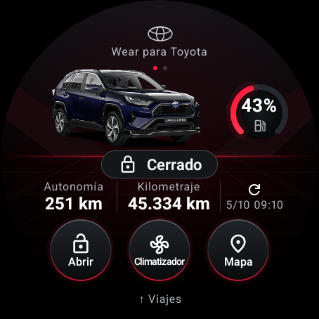
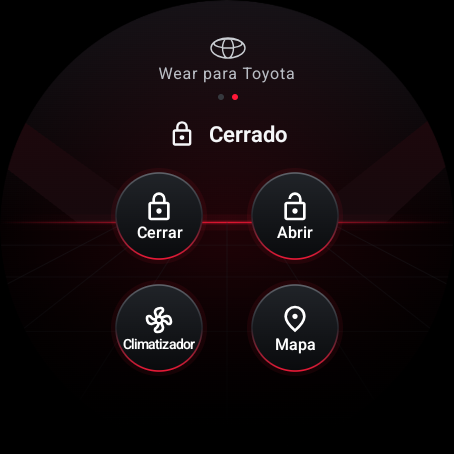
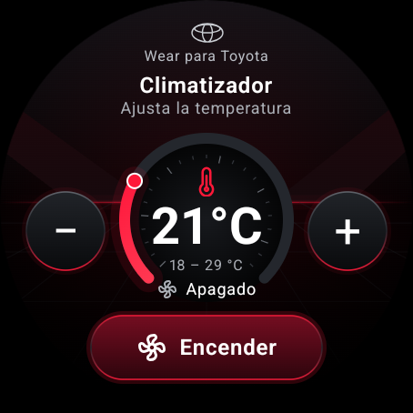
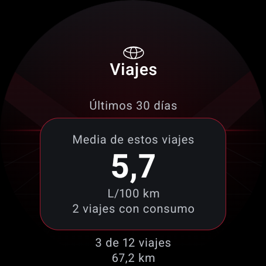
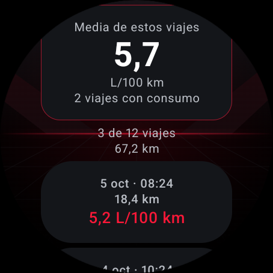
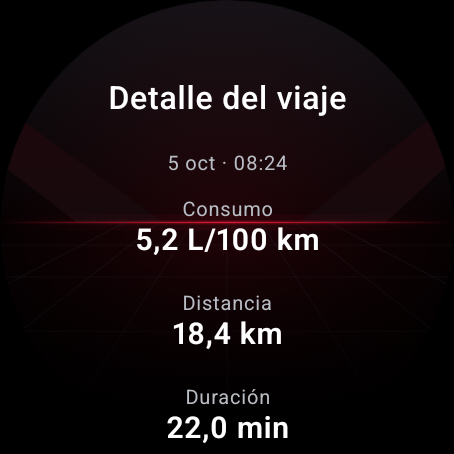

# Wear para Toyota

[](https://ko-fi.com/A0A71AC06Z)

App no oficial y autónoma para Wear OS pensada para coches Toyota y Lexus vendidos en Europa (cuentas de MyToyota / Toyota Connected Services Europe). Muestra si el coche está cerrado, la autonomía, el combustible o la batería y el kilometraje, y envía los comandos remotos que MyToyota ofrece para tu coche: cerrar, abrir y climatizador. En español, inglés, alemán, francés, italiano y portugués.

[English version](README.md)

> **No está afiliada a Toyota ni cuenta con su apoyo.** La app habla con el mismo backend que la app oficial MyToyota, tal y como lo ha documentado la comunidad (ver Créditos). Toyota puede cambiar ese backend en cualquier momento y dejar la app inservible. Úsala bajo tu responsabilidad y solo con tu propio coche y tu propia cuenta.

## Capturas

Capturas del emulador Wear OS con datos de demostración. Desplaza la lista de viajes y los detalles para ver más información.

| Estado del coche | Controles | Climatizador |
| :---: | :---: | :---: |
|  |  |  |

| Consumo medio | Viajes recientes | Detalle del viaje |
| :---: | :---: | :---: |
|  |  |  |

## Qué hace

- **Mi Garaje**: una tarjeta por coche de la cuenta, con la imagen oficial de Toyota.
- **Esfera de estado**: cerrado o abierto, combustible o batería con un indicador rojo compacto junto al coche, autonomía, kilometraje y cuándo informó el coche por última vez (tócalo para despertar al coche y pedir datos nuevos). Al abrir un coche se muestra un anillo de carga hasta que Toyota responde, así nunca ves datos viejos.
- **Esfera de controles** (desliza a la izquierda): cerrar, abrir, climatizador y última posición aparcado (abre la app de mapas del reloj). Abrir pide confirmación en pantalla. Tras cada orden la app despierta al coche y verifica su estado real antes de decirte "Vehículo cerrado".
- **Climatizador**: una esfera que giras con la corona o con los botones +/− (18–29 °C); encender o apagar durante 10 minutos.
- **Viajes y consumos** (desliza hacia arriba o toca la foto del coche): hasta 50 viajes de los últimos 30 días, media de consumo ponderada por distancia y detalle de cada trayecto. Muestra distancia, duración, combustible y velocidad media; porcentaje eléctrico y puntuación solo cuando Toyota los proporciona. Indica la cobertura y conserva los datos ausentes como desconocidos.
- **Autónoma**: el reloj habla con Toyota por sí mismo por Wi-Fi o LTE, o a través del Bluetooth del móvil emparejado. La app de móvil es opcional.
- **Mantiene la sesión**: el refresh token de Toyota mantiene la sesión. Si quieres, guarda la contraseña al iniciar sesión (desactivado por defecto, cifrada con su propia clave) y el reloj volverá a entrar solo si Toyota cierra la sesión.
- **Se actualiza sola**: como mucho una vez al día, al abrirla, el reloj busca una release nueva en GitHub y te ofrece instalarla.
- **Pensada para la batería**: sin sondeos en segundo plano, sin servicios, un único fichero de estado cifrado. Solo se despierta al coche cuando tú lo pides.

## Requisitos

- Una cuenta Toyota o Lexus en Europa con Connected Services y un coche con servicios remotos. Lo que MyToyota ofrezca para tu coche es lo que esta app puede hacer.
- Un reloj con Wear OS 3 o superior (Android 11, API 30+). Probado en un OnePlus Watch 3 (Wear OS 6) y en el emulador de Wear OS 5.
- Para compilar: JDK 17 o superior y un Android SDK con la plataforma 37 y build-tools 36. Android Studio es opcional; todo funciona desde la línea de comandos.

## Instalación fácil (Windows y Mac)

Descarga los instaladores de consola desde este repositorio:

- **Windows:** guarda [install.cmd](https://raw.githubusercontent.com/Poiki/wear-for-toyota/main/scripts/install.cmd) y ábrelo con doble clic. Descarga automáticamente el instalador PowerShell.
- **Mac:** guarda [install.command](https://raw.githubusercontent.com/Poiki/wear-for-toyota/main/scripts/install.command), ejecuta una vez `chmod +x ~/Downloads/install.command` y ábrelo en Terminal o con doble clic.

Descargan ADB de Google y el APK firmado más reciente, verifican SHA-256 e instalan conservando los datos. No necesitas Android Studio, Java ni permisos de administrador. Activa la depuración y autoriza el ordenador en el reloj; para Wi-Fi el script guía el emparejamiento y la conexión. En USB, Windows puede necesitar el controlador del fabricante. [Instrucciones detalladas](docs/INSTALL.md). Los scripts permanecen en el repositorio y cada release incluye un README de instalación.

## Instala tu propia copia

1. Clona el repositorio y compila las dos apps:

   ```bash
   cd android && ./gradlew :watch:assembleRelease :phone:assembleRelease
   ```

   En Windows usa `gradlew.bat`. Los APK quedan en `android/watch/build/outputs/apk/release/` y `android/phone/build/outputs/apk/release/`. Sin un keystore propio se firman con la clave debug, suficiente para instalarlos a mano.

2. Activa las opciones de desarrollador y la depuración inalámbrica en el reloj: Ajustes → Sistema → Información → toca siete veces "Número de compilación" → Opciones de desarrollador → Depuración inalámbrica. Después, desde el ordenador:

   ```bash
   adb pair <ip-del-reloj>:<puerto-de-emparejamiento>
   adb connect <ip-del-reloj>:<puerto>
   ```

3. Instala la app del reloj:

   ```bash
   adb -s <serial-del-reloj> install -r android/watch/build/outputs/apk/release/watch-release.apk
   ```

   También puedes saltarte el paso 1: descarga `wear-for-toyota-watch-<versión>.apk` de la [última release](https://github.com/Poiki/wear-for-toyota/releases/latest) e instálalo igual. Solo los APK oficiales firmados pueden recibir las actualizaciones oficiales.

4. Inicia sesión de cualquiera de las dos formas:
   - **En el reloj**: abre la app → "Iniciar sesión aquí" → escribe el email y la contraseña de MyToyota con el teclado del reloj.
   - **Desde el móvil** (opcional): instala `phone-release.apk` en el móvil emparejado con `adb install -r`, abre "Wear para Toyota" e inicia sesión. Los tokens viajan al reloj por el enlace Bluetooth; el móvil no guarda nada.

   Activa "Guardar contraseña" solo si quieres que el reloj vuelva a entrar solo cuando Toyota cierre la sesión.

5. Actualizaciones: cuando sale una release nueva, la app te la ofrece. La primera vez, el reloj abre el interruptor "Instalar apps desconocidas" de Wear para Toyota: actívalo, vuelve atrás y acepta otra vez. Después el instalador de Android te pide confirmación. Si tu reloj oculta ese interruptor, concédelo una vez desde el ordenador:

   ```bash
   adb -s <serial-del-reloj> shell appops set com.poiki.toyotawear REQUEST_INSTALL_PACKAGES allow
   ```

6. Opcional, para una release firmada con tu clave: crea `android/keystore.properties` con `storeFile`, `storePassword`, `keyAlias` y `keyPassword`. Está ignorado por git y se usa automáticamente. Los dos APK deben compartir firma para que funcione el enlace móvil → reloj. Android rechaza actualizaciones firmadas con otra clave, así que las copias firmadas con tu clave o con la clave debug no pueden instalar las releases oficiales que ofrece la app.

## Seguridad y privacidad

- La contraseña no se guarda salvo que actives "Guardar contraseña" al iniciar sesión. En ese caso el reloj la cifra con su propia clave AES-256 en el Android Keystore (en StrongBox si el reloj lo tiene). Esa clave solo funciona con el reloj desbloqueado, si tiene bloqueo de pantalla. El reloj solo lee la contraseña para volver a entrar cuando Toyota cierra la sesión, y la borra si Toyota la rechaza. Si el Keystore del reloj no puede protegerla así, no se guarda y la app te avisa.
- Los tokens OAuth siempre se guardan cifrados con una clave que vive en el Android Keystore; las copias de seguridad están desactivadas. "Desvincular" borra tokens, contraseña y datos en caché.
- Sin analítica ni servidores de terceros. El reloj solo habla con los servidores de Toyota (`*.toyotaconnectedeurope.io`, `b2c-login.toyota-europe.com`), una vez por coche con el CDN de imágenes de Toyota y, como mucho una vez al día, con GitHub (`api.github.com`) para buscar una release nueva. El APK solo se descarga de GitHub después de que aceptes.
- Las actualizaciones las instala el propio instalador de Android, tras tu confirmación. Android solo instala el APK si es esta app, firmada con la misma clave y no más antigua, así que rechaza un APK manipulado o ajeno.
- Los identificadores estáticos de la app oficial (client id, API key) son los públicos documentados por pytoyoda. Toyota puede cambiarlos.
- Abrir pide confirmación pero, por diseño, no un PIN del reloj. Quien lleve un reloj desbloqueado podría abrir tu coche. Si quieres esa barrera, configura un bloqueo de pantalla en el reloj: la app exigirá entonces que esté desbloqueado.
- Los logs nunca contienen tokens ni credenciales. Las ayudas de depuración (inyección de tokens, modo demo) no existen en los builds release.
- Política de privacidad completa: [PRIVACY.md](PRIVACY.md).
- ¿Has encontrado una vulnerabilidad o un fallo? Abre una incidencia. No pegues nunca tokens, VIN ni coordenadas.

## Límites conocidos

- Solo Europa; otras regiones usan backends distintos.
- La API no es oficial. Cuando Toyota la cambie, la app necesitará una actualización; las incidencias de pytoyoda son el sistema de alerta temprana.
- Los comandos remotos dependen del coche y de la suscripción. El climatizador funciona 10 minutos y Toyota limita los arranques por ciclo de contacto.
- El historial depende de los datos que Toyota devuelva para tu cuenta y coche. Consulta una página de hasta 50 viajes; la media corresponde a los viajes con datos, no necesariamente al mes completo. La respuesta real de viajes de la cuenta de desarrollo aún no se ha confirmado. No incluye comparación mensual ni gráfico de consumo instantáneo.
- No está en Google Play: Play prohíbe introducir contraseñas en el reloj y una API no oficial no pasaría la revisión. Solo instalación manual.

## Desarrollo

- [Guía de estilo](design.md) e [investigación de consumos](docs/consumption.md). El historial está incluido desde la 0.3.1.

- `android/core`: cliente Toyota (login, refresh, lecturas, comandos) y parseo de respuestas, con tests unitarios sobre fixtures reales: `./gradlew :core:testDebugUnitTest`.
- `android/watch` y `android/phone`: las dos apps. Compose for Wear OS Material 3; la app de móvil es una sola pantalla.
- Modo demo (solo builds debug): `adb shell am start -n com.poiki.toyotawear/.MainActivity --ez demo true` siembra un coche ficticio para trabajar en la interfaz sin cuenta.
- `probe/probe.py`: volcado de solo lectura de lo que Toyota devuelve para una cuenta (`uv run probe/probe.py`).
- `docs/`: investigación sobre la API y la autenticación de Toyota, el stack de Wear OS, las apps de reloj de otros fabricantes, las decisiones técnicas y las mediciones.
- Los informes de fallos y las ideas de mejora son bienvenidos: abre una incidencia o un pull request.

## Créditos

- [pytoyoda](https://github.com/pytoyoda/pytoyoda) y [ha_toyota](https://github.com/pytoyoda/ha_toyota) (MIT): la documentación comunitaria de la API de MyToyota Europa que sigue esta app (endpoints, cabeceras, flujo de login, estrategia de wake y refresco). Los fixtures de test de `android/core/src/test/resources` proceden de pytoyoda.
- [DurgNomis-drol/mytoyota](https://github.com/DurgNomis-drol/mytoyota), el proyecto del que desciende pytoyoda. También estudiados: [openhab-mytoyota-binding](https://github.com/Prinsessen/openhab-mytoyota-binding), [evcc](https://github.com/evcc-io/evcc) e [ioBroker.toyota](https://github.com/TA2k/ioBroker.toyota).
- [Material Symbols](https://github.com/google/material-design-icons) (Apache 2.0) para los iconos.
- [Wear OS samples](https://github.com/android/wear-os-samples) (Apache 2.0) como base del proyecto Compose for Wear OS.

## Licencia

[PolyForm Noncommercial 1.0.0](LICENSE): úsala, modifícala y compártela libremente para fines no comerciales, conserva el aviso de copyright y da crédito a este proyecto en lo que construyas sobre él.
