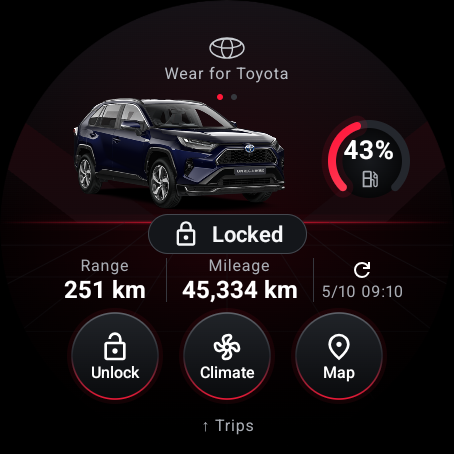
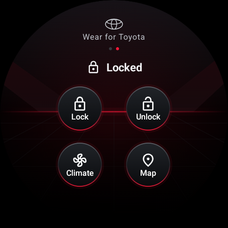
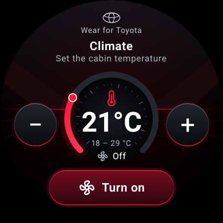
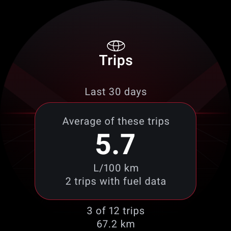
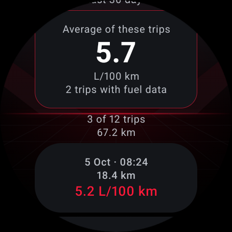
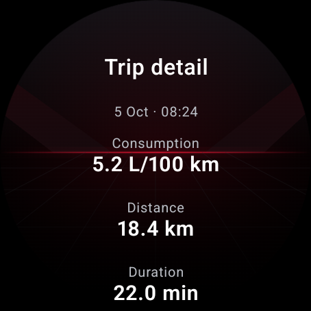

# Wear for Toyota

[](https://ko-fi.com/A0A71AC06Z)

Unofficial, standalone Wear OS app for Toyota and Lexus cars sold in Europe (MyToyota / Toyota Connected Services Europe accounts). It shows the lock state, range, fuel or battery and mileage, and sends the remote commands MyToyota offers for your car: lock, unlock and climate. English, Spanish, German, French, Italian and Portuguese.

[Versión en español](README.es.md)

> **Not affiliated with, endorsed by or supported by Toyota.** The app talks to the same backend as the official MyToyota app, as documented by the community (see Credits). Toyota can change that backend at any time and break the app. Use it at your own risk and only with your own car and account.

## Screenshots

Wear OS emulator screenshots with demonstration data. Scroll the trip list and details to see more information.

| Vehicle status | Controls | Climate |
| :---: | :---: | :---: |
|  |  |  |

| Average consumption | Recent trips | Trip detail |
| :---: | :---: | :---: |
|  |  |  |

## What it does

- **My Garage**: one card per car on the account, with Toyota's own picture of the car.
- **Status dial**: locked / unlocked, fuel or battery with a compact red gauge beside the car, range, mileage, and when the car last reported (tap it to wake the car for fresh data). Opening a car shows a loading ring until Toyota answers, so you never see old data.
- **Controls dial** (swipe left): lock, unlock, climate and the last parked position (opens the maps app on the watch). Unlocking asks for an on-screen confirmation. After every command the app wakes the car and verifies the real state before telling you "Vehicle locked".
- **Climate**: a dial you turn with the crown or the +/- buttons (18–29 °C); start or stop for 10 minutes. **Climate options** shows supported defoggers, heated steering wheel and heated/ventilated seats. Tap to cycle a selection, then **Apply and start** to send everything together. This starts or restarts climate and uses a remote start; selections are not live status. Missing readback remains unconfirmed. These extras have been tested locally, without sending live vehicle commands.
- **Trips and consumption** (swipe up or tap the car photo): up to 50 trips from the last 30 days, a distance-weighted fuel average and trip details. Distance, duration, fuel and average speed are shown; electric-distance share and Toyota score appear only when supplied. Coverage is explicit and missing values remain unknown. Includes a chart of up to 12 dated trips and an electric-distance bar when data is supplied.
- **Standalone**: the watch talks to Toyota on its own over Wi-Fi or LTE, or through the Bluetooth proxy of the paired phone. The phone app is optional.
- **Stays signed in**: Toyota's refresh token keeps the session alive. Optionally, save your password at sign-in (off by default, encrypted under its own key) and the watch signs in again by itself if Toyota ever ends the session.
- **About app** (garage or sign-in screen): installed version, manual update check and confirmed removal of the session, saved password and vehicle data. Manual checks bypass the daily interval.
- **Updates itself**: at most once a day, when you open it, the watch looks for a new release on GitHub and offers to install it.
- **Battery-friendly by design**: no background polling, no services, one small encrypted state file. The car is only woken when you ask.

## Requirements

- A Toyota or Lexus account in Europe with Connected Services, and a car with remote services. Whatever MyToyota offers for your car is what this app can do.
- A Wear OS 3 or newer watch (Android 11, API 30+). Tested on a OnePlus Watch 3 (Wear OS 6) and the Wear OS 5 emulator.
- To build: JDK 17 or newer and an Android SDK with platform 37 and build-tools 36. Android Studio is optional; everything works from the command line.

## Easy install (Windows and macOS)

Download the console installers from this repository:

- **Windows:** save [install.cmd](https://raw.githubusercontent.com/Poiki/wear-for-toyota/main/scripts/install.cmd), then double-click it. It downloads its PowerShell installer automatically.
- **Mac:** save [install.command](https://raw.githubusercontent.com/Poiki/wear-for-toyota/main/scripts/install.command), run `chmod +x ~/Downloads/install.command` once, then open it in Terminal or double-click it.

They download Google's ADB tools and the latest signed watch APK, verify SHA-256 and install without deleting app data. No Android Studio, Java or administrator access is required. You must enable debugging and authorize the computer on the watch; for Wi-Fi the script guides pairing and connection. Windows USB may require the manufacturer's driver. [Step-by-step installation](docs/INSTALL.md). The scripts stay in the repository; every release includes installation instructions.

The Windows launcher downloads readable script text and uses `RemoteSigned` for that PowerShell process. The script is not yet Authenticode-signed. If antivirus blocks it, stop installation and request a vendor review; see [details and manual installation](docs/INSTALL.md#antivirus-and-powershell-policy).

## Install your own copy

1. Clone the repository and build both apps:

   ```bash
   cd android && ./gradlew :watch:assembleRelease :phone:assembleRelease
   ```

   On Windows use `gradlew.bat`. The APKs land in `android/watch/build/outputs/apk/release/` and `android/phone/build/outputs/apk/release/`. Without your own keystore they are signed with the debug key, which is fine for sideloading.

2. Enable developer options and wireless debugging on the watch: Settings → System → About → tap "Build number" seven times → Developer options → Wireless debugging. Then, from your computer:

   ```bash
   adb pair <watch-ip>:<pairing-port>
   adb connect <watch-ip>:<port>
   ```

3. Install the watch app:

   ```bash
   adb -s <watch-serial> install -r android/watch/build/outputs/apk/release/watch-release.apk
   ```

   You can also skip step 1: download `wear-for-toyota-watch-<version>.apk` from the [latest release](https://github.com/Poiki/wear-for-toyota/releases/latest) and install it the same way. Only the official signed APKs can take the official updates.

4. Sign in, either way:
   - **On the watch**: open the app → "Sign in here" → type your MyToyota email and password with the watch keyboard.
   - **From the phone** (optional): install `phone-release.apk` on the paired phone with `adb install -r`, open "Wear for Toyota", sign in. The tokens travel to the watch over the Bluetooth link; the phone keeps nothing.

   Turn on "Save password" only if you want the watch to sign in again by itself when Toyota ends the session.

5. Updates: when a new release is out, the app offers it. The first time, the watch opens the "Install unknown apps" switch for Wear for Toyota: turn it on, go back and accept again. Android's installer then asks you to confirm. If your watch hides that switch, grant it once from the computer:

   ```bash
   adb -s <watch-serial> shell appops set com.poiki.toyotawear REQUEST_INSTALL_PACKAGES allow
   ```

6. Optional, for a signed release of your own: create `android/keystore.properties` with `storeFile`, `storePassword`, `keyAlias` and `keyPassword`. It is git-ignored and picked up automatically. Both APKs must share the same signature for the phone → watch link to work. Android refuses updates signed with a different key, so copies signed with your own key or the debug key cannot install the official releases the app offers.

## Security and privacy

- Your password is not stored unless you turn on "Save password" at sign-in. If you do, the watch encrypts it with its own AES-256 key in the Android Keystore (in StrongBox when the watch has one). That key only works while the watch is unlocked, if it has a screen lock. The watch reads the password only to sign in again when Toyota ends the session, and deletes it if Toyota rejects it. If the watch's Keystore can't protect it that way, the password is not saved and the app tells you.
- The OAuth tokens are always encrypted with a key that lives in the Android Keystore; backups are disabled. "Unlink" deletes tokens, password and cached data.
- No analytics and no third-party servers. The watch talks only to Toyota's endpoints (`*.toyotaconnectedeurope.io`, `b2c-login.toyota-europe.com`), once per car to Toyota's image CDN, and at most once a day to GitHub (`api.github.com`) to look for a new release. The APK is downloaded from GitHub only after you accept.
- Updates go through Android's own installer, after your confirmation. Android only installs the APK if it is this app, signed with the same key and not older, so a tampered or foreign APK is refused.
- The static identifiers of the official app (client id, API key) are the public ones documented by pytoyoda. Toyota may rotate them.
- Unlocking asks for confirmation but, by design, not for a watch PIN. Anyone wearing an unlocked watch could unlock your car. If you want that barrier, set a screen lock on the watch: the app then also requires the watch to be unlocked.
- Logs never contain tokens or credentials. The debug-only helpers (token injection, demo mode) do not exist in release builds.
- Full privacy policy: [PRIVACY.md](PRIVACY.md).
- Found a vulnerability or a bug? Open an issue. Please never paste tokens, VINs or coordinates.

## Known limits

- Europe only; other regions use different backends.
- The API is unofficial. When Toyota changes it, the app needs an update; pytoyoda's issue tracker is the early-warning system.
- Remote commands depend on your car and subscription. Climate runs for 10 minutes and Toyota caps the number of starts per ignition cycle.
- Trip history depends on the data Toyota supplies for your account and vehicle. It reads one page of up to 50 trips; the average covers trips with valid data, not necessarily the full month. A live trip response for the development account has not yet been confirmed. Full-month comparisons and instantaneous consumption graphs are not included.
- Not on Google Play: Play forbids password input on the watch, and an unofficial API would not pass review. Sideload only.

## How average consumption is calculated

Each trip uses `100 × litres / kilometres`. The history average is `100 × total litres / total kilometres`, equivalent to weighting each trip rate by its distance. For example, 10 km at 10 L/100 km and 90 km at 5 L/100 km yield 5.5 L/100 km. Only trips with fuel and valid distance are included; zero fuel counts, missing data does not. The average covers the displayed sample.

## Development

- [Visual style](design.md) and [trip consumption research](docs/consumption.md). Trip history is included from 0.3.1.

- `android/core`: Toyota client (login, refresh, reads, commands) and payload parsing, with unit tests on real fixtures: `./gradlew :core:testDebugUnitTest`.
- `android/watch` and `android/phone`: the two apps. Compose for Wear OS Material 3; the phone app is a single screen.
- Demo mode (debug builds only): `adb shell am start -n com.poiki.toyotawear/.MainActivity --ez demo true` seeds a fake car so you can work on the UI without an account.
- `probe/probe.py`: read-only dump of what Toyota returns for an account (`uv run probe/probe.py`).
- `docs/`: research on the Toyota API and authentication, the Wear OS stack, other manufacturers' watch apps, the technical decisions and the measurements.
- Bug reports and improvement ideas are welcome: open an issue or a pull request.

## Credits

- [pytoyoda](https://github.com/pytoyoda/pytoyoda) and [ha_toyota](https://github.com/pytoyoda/ha_toyota) (MIT): the community documentation of the MyToyota Europe API this app follows (endpoints, headers, login flow, wake and refresh strategy). The test fixtures in `android/core/src/test/resources` come from pytoyoda.
- [DurgNomis-drol/mytoyota](https://github.com/DurgNomis-drol/mytoyota), the project pytoyoda descends from. Also studied: [openhab-mytoyota-binding](https://github.com/Prinsessen/openhab-mytoyota-binding), [evcc](https://github.com/evcc-io/evcc) and [ioBroker.toyota](https://github.com/TA2k/ioBroker.toyota).
- [Material Symbols](https://github.com/google/material-design-icons) (Apache 2.0) for the icons.
- [Wear OS samples](https://github.com/android/wear-os-samples) (Apache 2.0) for the Compose for Wear OS project baseline.

## License

[PolyForm Noncommercial 1.0.0](LICENSE): use, modify and share it freely for noncommercial purposes, keep the copyright notice, and credit this project in anything you build on it.
